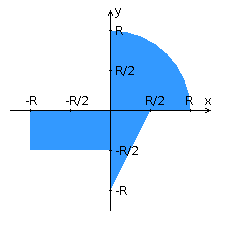

<h2>Разработать приложение на базе JavaServer Faces Framework, которое осуществляет проверку попадания точки в заданную область на координатной плоскости.</h2>

Приложение должно включать в себя 2 facelets-шаблона - стартовую страницу и основную страницу приложения, а также набор управляемых бинов (managed beans), реализующих логику на стороне сервера.

<b>Стартовая страница должна содержать следующие элементы:</b>

	1. "Шапку", содержащую ФИО студента, номер группы и номер варианта.
	2. Интерактивные часы, показывающие текущие дату и время, обновляющиеся раз в 5 секунд.
	3. Ссылку, позволяющую перейти на основную страницу приложения.

<b>Основная страница приложения должна содержать следующие элементы:</b>

	1. Набор компонентов для задания координат точки и радиуса области в соответствии с вариантом задания. Может потребоваться использование дополнительных библиотек компонентов - ICEfaces (префикс "ace") и PrimeFaces (префикс "p"). Если компонент допускает ввод заведомо некорректных данных (таких, например, как буквы в координатах точки или отрицательный радиус), то приложение должно осуществлять их валидацию.
	2. Динамически обновляемую картинку, изображающую область на координатной плоскости в соответствии с номером варианта и точки, координаты которых были заданы пользователем. Клик по картинке должен инициировать сценарий, осуществляющий определение координат новой точки и отправку их на сервер для проверки её попадания в область. Цвет точек должен зависить от факта попадания / непопадания в область. Смена радиуса также должна инициировать перерисовку картинки.
	3. Таблицу со списком результатов предыдущих проверок.
	4. Ссылку, позволяющую вернуться на стартовую страницу.

<b>Дополнительные требования к приложению:</b>

	1. Все результаты проверки должны сохраняться в базе данных под управлением СУБД PostgreSQL.
	2. Для доступа к БД необходимо использовать ORM Hibernate.
	3. Для управления списком результатов должен использоваться Application-scoped Managed Bean.
	4. Конфигурация управляемых бинов должна быть задана с помощью параметров в конфигурационном файле.
	5. Правила навигации между страницами приложения должны быть заданы в отдельном конфигурационном файле.

